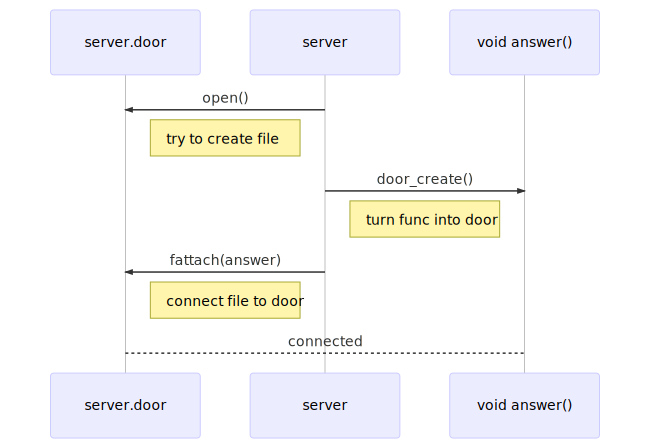

[Previous](.././18_backgrounding_processes/) | [Next](.././40_knock_knock/)

# Create a door
*Create a door and show what it looks like on the filesystem*

Here's where stuff starts to get intersting. First, we build on the previous
lesson by calling `fdetach` on the path that we intend to use to advertise our
door to other processes. This ensures that any lingering doors are removed
(perhaps from previous attempts, or crashed processes, or another user squatting
on this path).

Next, we create the actual "door": This is a file descriptor that is associated
with a pointer to the `answer` function. We do this using the `DOOR_CREATE(3C)`
call referenced below.

If that succeeds, we can attach this file descriptor to the filesystem using the
`fattach` call. 



Run `make test` to build and launch this version of the door server in the
background. Now run `ls -AhlF server.door` and take a close look at the output.
You should see something like the following:

```
$ ls -AhlF server.door
Dr--r--r-- 1 root root 0 Mar 25 11:02 server.door>
```

The `D` in the permissions field and the `>` at the end of the filename tell us
that we are dealing with a door: a filesystem path that when `open`ed grants
access to a function within a running process. 

Now we will learn how to open doors and call door functions.

### New System Calls
* [FDETACH(3C)](https://illumos.org/man/3C/fdetach)
* [DOOR_CREATE(3C)](https://illumos.org/man/3c/door_create)
* [FATTACH(3C)](https://illumos.org/man/3C/fattach)

## Check for Understanding
1. What changes about `server.door`'s attributes when `fattach` is called?
1. How can we leverage the fact that a door has normal UNIX access permissions?
