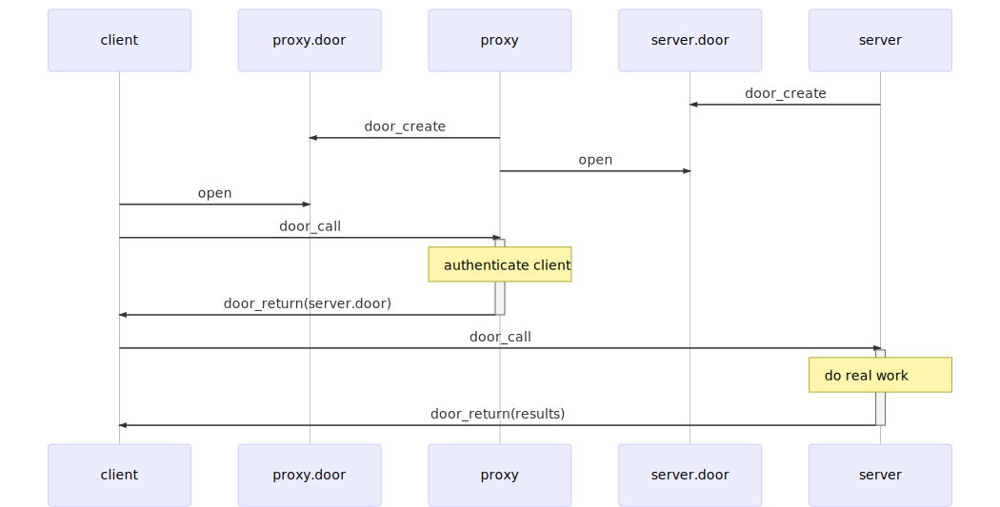

[Previous](.././C0_payload_size/) | [Next](.././FF_finish/)

# Pass a door through a door
*This is really the killer feature*

In this lesson, we show how to use the `door_return` call to pass an open door
descriptor to another process. This can be a bit weird to wrap your head around,
but it is an amazing capability.

Consider three processes: **client**, **proxy**, and **server**. Process **server** creates a door which can be
opened by **proxy**, then process **proxy** creates a door which can be opened by **client**. When **client**
performs `door_call` on **proxy**'s door, **proxy** can `door_return` its descriptor to **server**. When
**client**'s `door_call` completes, **client** will have a new open door descriptor pointing to
the door that **server** opened for **proxy**. This allows **client** and **server** to communicate without
explicit knowledge of one another's identities.

*But why not let client and server communicate directly?*

In this situation, process **proxy** has the opportunity to decide whether **client** and **server**
should communicate. For example, **proxy** may require some form of credentials from **client**
before allowing access to **server**. This allows **server** to focus on doing what it does best,
leaving it up to **proxy** to focus on the authentication question.

As another example, **proxy** could act as a sortof router: inspecting the requests
coming from **client** before handing **client** a door descriptor either to **server** or some other door
server process as appropriate.

This is weird, and it's worth thinking about slowly.
