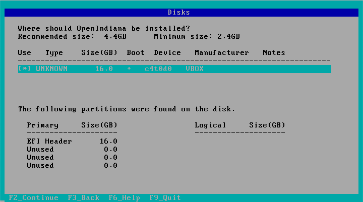
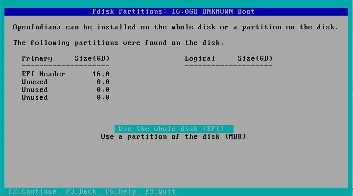
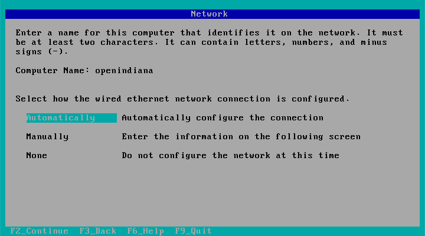
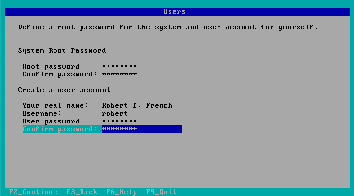
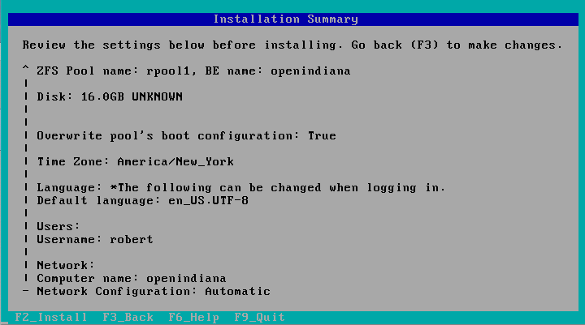
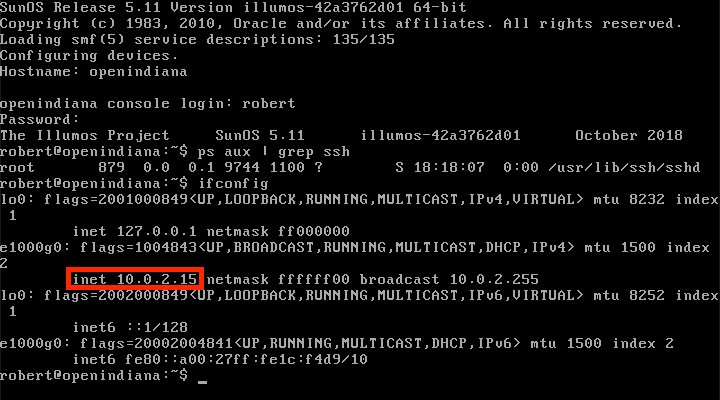
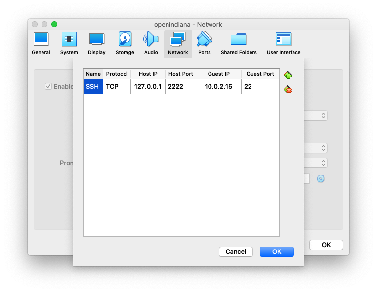

# Setup OpenIndiana on VirtualBox
*From zero to illumos in ten minutes*

### Install Virtualbox
[Download Virtualbox](https://www.virtualbox.org/wiki/Downloads) for whatever
platform you are running on your workstation. Click through the installation
wizard. You will likely need to give your permission to trust software written
by Oracle. The irony...

### Download OpenIndiana
[Download OpenIndiana](https://www.openindiana.org/download/). I suggest the
minimal install, as that takes up the least space. The rest of this guide will
walk you through setting up what packages you need to run the lessons.

### Create a VM
Within virtualbox, create a new VM named 'openindiana':

* Type: *Solaris*
* Version: *Oracle Solaris 11 (64-bit)*

#### RAM
The recommended memory is fine, or even less: we will use very little for these
lessons.

#### Storage
A default-sized, dynamically allocated virtual disk will be fine. We won't
hardly use any disk resources.

#### Boot Disc
Under *Settings > Storage*, you should see a storage device under the main SATA
controller named 'Empty': this is your virtual optical drive. We will attach the
OpenIndiana iso that we just downloaded here so that our machine can boot up.

### Install OpenIndiana
Boot the machine and begin the install. I'll leave it up to you to handle things
like your keyboard layout, timezone, etc. But for new illumos users (or new
virtual box users!), here are a few screenshots that will make sure you are on
the right track:

#### Disk Size


Accept the whole virtual disk. We configured this virtual machine to provision
the underlying disk file dynamically, so this will not automatically eat up 16GB
of your workstation's storage.



#### Network Config
Name the system 'openindiana' (or whatever you prefer) and select 'Automatically'
for how the wired network should be configured. Later we will set up VirtualBox
to allow you to SSH from your workstation.



#### Initial Users
Create a root password and a user for yourself. Keep in mind, this box won't be
reachable from outside of your workstation.



#### Installation Summary
Before you confirm the install, you should be presented with a screen that looks
like mine below:



After you reboot, you'll need to remove the virtul disc that contains the
installation iso we downloaded earlier. This is like what we did back in the day
when you had to eject the install CD real quick after your machine reboots, so
that you can access the OS you just installed, instead of booting back into the
installation program. Computers, I tell ya what...

There are two ways to do this: either hit `F12` right after your VM reboots, or
just go ahead and kill the VM after the installation is complete, and then use
the VirtualBox *Settings > Storage* menu to eject the disc (same place that we
used earlier to insert the disc). If you get stuck, no worries; this is a very
googleable problem.

### Configuring SSH Access
Before we do anything else, let's configure SSH on our new OpenIndiana VM so
that we can do the remainder of the setup (and the tutorials!) from the comfort
of our workstations.

Luckily for us, SSHd is already installed and running by default on OpenIndiana.
What we need to do is configure VirtualBox to forward traffic from your host so
that it (and only it!) can reach the new OpenIndiana VM.

#### Find the host IP address
Log in to your new VM and run `ifconfig` to see what IP address it has been
assigned. You'll see two entries: `127.0.0.1` and another one... we want the
other one.



#### Configure Port Forwarding
Navigate to *Settings > Network* for this VM and click 'Advanced':


Now click the 'Port Forwarding' button and create a new entry using the IP
address for the virtual machine you found above:



To test this out, pull up a shell on your workstation and attempt to log in to
your OpenIndiana VM by specifying the redirected port with the `-p` flag:

```bash
ssh -p 2222 <username>@127.0.0.1
```

You will then be prompted for your password, and (hopefully) granted shell
access!

##### Uhh... I got a huge nasty warning
If you got something like this:

```
@@@@@@@@@@@@@@@@@@@@@@@@@@@@@@@@@@@@@@@@@@@@@@@@@@@@@@@@@@@
@    WARNING: REMOTE HOST IDENTIFICATION HAS CHANGED!     @
@@@@@@@@@@@@@@@@@@@@@@@@@@@@@@@@@@@@@@@@@@@@@@@@@@@@@@@@@@@
IT IS POSSIBLE THAT SOMEONE IS DOING SOMETHING NASTY!
Someone could be eavesdropping on you right now (man-in-the-middle attack)!
It is also possible that a host key has just been changed.
```

You can be fairly confident that this is in fact just the last line. The host
key of this new virtual machine is almost certainly not known to your desktop,
so if you have ever used local port forwarding to access an SSH host before,
that previous host's key will still be in your `~/.ssh/known_hosts` file. Just
do what the message says -- hop in that file and delete the offending line.

### Getting ready for the Tutorial
The doors tutorial requires git, Make and a C compiler. To set these up, follow
these steps (offering your root password when prompted by `su`):

```bash
su
pkg install git
pkg install gnu-make
pkg install developer/gcc-8
pkg install system/header
```

Now make sure you can build all the lessons (that way you can straighten any
missing dependencies out beforehand):

```bash
git clone https://github.com/robertdfrench/revolving-door.git
cd revolving-door
gmake test
```
